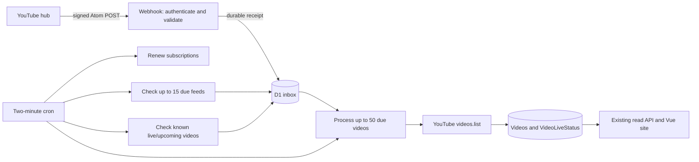

# YouTube push: setup and operation

Updated September 24, 2026 (Alaska). Production uses push mode with API fallback. The ten-minute RSS watchdog described below was deployed September 25 at approximately 01:18 UTC. See the [release review](2026-09-24-release-review.md) for the missing-stream diagnosis. The existing production database already has migrations through 0008; this change needs no new migration. A verified subscription does not prove notifications are arriving.

## API fallback

### Current staging domain

`api.singularitystream.org` is the production API for **twitch-proxy**. Staging uses `staging-api.singularitystream.org` for **singularity-streams-staging**. Use the matching Wrangler config and callback origin for each environment.

For local staging, set `VITE_API_BASE_URL=https://staging-api.singularitystream.org` in the ignored `.env.staging`. Use `npm run dev:staging` or `npm run build:staging`. These commands do not publish GitHub Pages. A shell-provided `VITE_API_BASE_URL` overrides the env file.

After `npx wrangler deploy --config worker/wrangler.staging.jsonc`, use the staging hostname for testing. Do not move production's domain or deploy the staging config against production resources.

Set `YOUTUBE_FALLBACK_ENABLED="true"` alongside push mode (enabled in the local staging config). A creator falls back when its verified lease is absent/expired or its feed health is failed/unknown. Both a successful feed check and an active verified lease are required to stop fallback. Silence is not an outage signal; this does not detect every silent delivery failure.

The first poll is due immediately on the next cron, normally within two minutes, then every ten minutes. Browser refreshes and isolate startups do not trigger polling. Up to 15 due creators run per tick with concurrency three. Uploads playlist IDs are retrieved through `channels.list` and cached; `playlistItems.list` reads the latest 50 entries only. New IDs enter the existing inbox without resetting pending retries or re-enriching completed entries. Known live/upcoming checks continue separately. Initial enrichment processes 50 videos per cron, so a large backlog takes additional ticks.

RSS checks run every ten minutes after success regardless of subscription health, and every thirty minutes after a feed failure. Each cron handles up to fifteen due feeds with concurrency three. Older six-hour schedules are shortened automatically using `FeedCheckedAt`. Unchanged feed notices are deduplicated; only new/newer events enqueue enrichment. Known live/upcoming videos are still checked independently. Subscription renewals continue, and API fallback failures wait ten minutes before retrying.

Separate diagnostic fields are `FeedHealthy`, `FeedCheckedAt`, `FeedError`, `SubscriptionError`, `LastPollAt`, `PollAt`, and `PollError`. `LastError` is the legacy shared field. Logs with `operation="youtube-fallback"` report successful discovery or sanitized failures. `LastPollAt` does not mean every discovered video has finished enrichment.

Limitations: this is recent discovery, not historical backfill. Uploads playlist coverage of upcoming/active streams still needs real staging validation. During prolonged RSS failure, completed ordinary videos are not continually re-enriched for title/description edits. Normal feed reconciliation refreshes them when RSS recovers. API polling has bounded request counts per tick, not an account-wide quota circuit breaker.

Staging rollout (no new secrets):

```powershell
npx wrangler d1 migrations apply singularitystream-staging-db --remote --config worker/wrangler.staging.jsonc
npx wrangler deploy --config worker/wrangler.staging.jsonc
```

## Data flow



The endpoint is `GET/POST /youtube/webhook/{persisted-random-callback-id}`. Management runs inside the cron; there is no public subscription/refresh action. Callback IDs are allocated from members' YouTube channel IDs and are not credentials. Signing material stays in a Worker secret.

GET verifies a pending subscribe request, exact topic, challenge, and granted lease. POST verifies SHA-1 or SHA-256 HMAC against raw bytes before parsing; requires an active known subscription; rejects DTDs/entities, malformed XML, foreign channels, over 50 entries, and bodies over 128 KiB. Webhooks bypass response caching. Invalid signatures are acknowledged with 204 and discarded, as specified by PubSubHubbub 0.4. Database failures return 503 so the hub can retry. No third-party URL from the payload is fetched.

The D1 inbox holds one row per video, including completed rows as a delivery timestamp high-water mark. Duplicate/older deliveries do not re-enqueue work. A revision check prevents enrichment from clearing a newer delivery received during the API request. Current metadata comes from `videos.list`, including authoritative channel ownership, description, thumbnails and live details. Only then are video records updated. A crash before completion leaves work retryable; repeated upserts are safe.

## Schedule and limits

| Work | Policy |
| --- | --- |
| Cron | Every two minutes, using the existing trigger |
| Overlap protection | Atomic D1 lease; expires after five minutes following a crashed invocation |
| Subscription requests | At most two per tick; request five days, renew at 80% of the actual granted lease |
| Pending verification | Valid for ten minutes; retry subscription request after fifteen minutes if unverified/failed |
| Reconciliation | Up to fifteen due channels per tick, concurrency three; successful feeds every ten minutes, failed feeds every thirty minutes |
| Live status | Known live streams and upcoming streams within fifteen minutes of their planned start are eligible every two minutes |
| Distant upcoming streams | Eligible every thirty minutes |
| Enrichment | At most fifty due videos, one `videos.list` call per tick |
| Retry | Per-video exponential delay from one minute, capped at six hours, plus up to ten seconds of jitter |
| API omission | Revoke a missing video's live claim immediately, retain retries; after repeated omissions clear remaining live metadata and continue slower probes |
| External request timeout | Ten seconds per request; redirects are rejected as unsuccessful responses |

Queue backlogs, upstream outages, and cron timing can delay those nominal intervals. There is no immediate enrichment on the webhook HTTP request; normal discovery latency is up to roughly a cron interval plus existing response cache TTLs. This does not push updates into an already-open browser tab.

For fifteen healthy feeds, reconciliation is approximately `15 × 144 = 2,160` requests/day or `64,800` per thirty days: **80% fewer** than checking all feeds every two minutes. The old six-hour estimate of 1,800/month is superseded because it left a large blind spot when push delivery failed silently. RSS does not use YouTube Data API quota. Unchanged entries do not trigger enrichment. These figures exclude renewals, webhook deliveries, fallback and live/enrichment API calls. Cron invocations remain 21,600 per thirty days. These are request estimates, not a billing guarantee; retain the paid-tier safeguards and measure hosted CPU and D1 usage.

## Local verification

From the repository root, with Node 24 (or a supported version in `package.json`):

```sh
npm ci
npm run check:backend
```

The suite uses isolated Miniflare D1/KV, explicit dummy credentials, real migrations, and mocked outbound traffic. It neither reads production Wrangler bindings nor makes real YouTube requests. GitHub Actions runs the same check on pushes and pull requests.

For manual local Wrangler development, copy `worker/.dev.vars.example` to `worker/.dev.vars` and supply secrets locally. Local credential files are ignored by Git. Public hub verification cannot reach a normal localhost address.

## Staging before cutover

1. Authenticate the Cloudflare CLI locally with `npx wrangler login`. Do not put credentials in chat, Git, or shell command arguments.
2. Create a **separate** staging Worker config and staging D1/KV resources. The existing `env.dev` currently repeats the production resource IDs: it is not a safe remote staging environment. Copy `worker/wrangler.staging.example.jsonc` to `worker/wrangler.staging.jsonc`, create staging D1/KV with Wrangler or the dashboard, and replace the example IDs. Keep `YOUTUBE_PUSH_ENABLED` false initially.
3. Apply migrations to that staging config, then install secrets using interactive prompts:

   ```sh
   npx wrangler d1 migrations apply DB --remote --config worker/wrangler.staging.jsonc
   npx wrangler secret put YOUTUBE_API_KEY --config worker/wrangler.staging.jsonc
   npx wrangler secret put YOUTUBE_WEBHOOK_SECRET --config worker/wrangler.staging.jsonc
   npx wrangler secret put TWITCH_CLIENT_SECRET --config worker/wrangler.staging.jsonc
   ```

   Generate a cryptographically random webhook secret of 32–199 bytes; 32 random bytes encoded as hex is suitable. Keep it in a password manager and provide it at Wrangler's prompt. The YouTube key is separate from the webhook signing secret. The existing Twitch credentials are needed only for Twitch functionality.
4. Set `YOUTUBE_CALLBACK_URL` to the staging Worker's public HTTPS origin plus `/youtube/webhook` (no trailing slash, query or fragment). Set `YOUTUBE_PUSH_ENABLED` to the literal string `true`. Deploy using `npx wrangler deploy --config worker/wrangler.staging.jsonc`.
5. The cron creates subscriptions automatically. With fifteen channels, subscription requests span about sixteen minutes, while all initial feed checks can run on the first cron. Enrichment remains limited to fifty videos per cron, so initial backlog completion can take additional ticks. Confirm a real hub GET challenge, granted lease, signed POST, subsequent API enrichment, unchanged public response shape, and renewal. Synthetic tests cannot prove Google's deployed hub behavior.
6. Verify a genuine upload/title edit and a stream's upcoming → live → ended progression. Check failures and quota use before production cutover. Staging is a separate installation and consumes its own API calls; it does not automatically compare records with production.

## Production activation and rollback

Once staging is verified, apply migrations through 0007 to production using the root Worker config, set the production signing secret through `wrangler secret put`, replace the callback placeholder, set push enabled, and deploy. Existing API/Twitch secrets must remain configured. Make an appropriate D1 backup before the migration. The migration is additive; no rows are deleted.

To return to full feed polling, set `YOUTUBE_PUSH_ENABLED` to `false` and redeploy this version. Leave the new tables/column in place. This stops subscription renewal and makes callbacks return 404; hub leases eventually expire. The old polling cost returns. Re-enabling uses stored callback identities and renews due leases. Avoid rolling back the database schema while running this code.

If rotating the signing secret or changing callback origin, install the new configuration and make subscriptions due (`UPDATE YoutubeSubscriptions SET RenewAt=0`). Each cron renews at most two channels; deliveries signed with the old secret are discarded until renewal. Reconciliation is the fallback during that window. Do not print secrets or complete subscription request bodies in logs.

## Monitoring

Run these read-only queries against the intended D1 database through the dashboard or `wrangler d1 execute DB --remote --config <chosen-config> --command <query>`:

```sql
SELECT ChannelId, LeaseExpiresAt, RenewAt, LastDeliveryAt, LastError
FROM YoutubeSubscriptions ORDER BY LeaseExpiresAt;

SELECT COUNT(*) AS Pending, MIN(NextAttemptAt) AS OldestDue
FROM YoutubeInbox WHERE NextAttemptAt IS NOT NULL;

SELECT VideoId, Attempts, NextAttemptAt, LastError
FROM YoutubeInbox WHERE Attempts > 0 ORDER BY NextAttemptAt LIMIT 50;
```

Timestamps are Unix milliseconds. Watch expired subscriptions, an increasing overdue backlog, repeated failures, API quota, CPU, D1 reads/writes, and subrequest counts. `LastError` is the most recent failure diagnostic, not a standalone health flag; a reconciliation error can remain after a later successful feed fetch. Completed inbox rows intentionally accumulate one small row per discovered video to retain deduplication history.

Structured `youtube-webhook` logs distinguish `result="accepted"` from `reason="signature-rejected"` without logging signing material. Successful `youtube-reconcile` logs include the channel, entry count, and next check time. `LastDeliveryAt=NULL` means no accepted notification has been recorded, even if the lease is valid. Quiet channels alone do not prove an outage. Google's detailed subscription diagnostic page requires the matching HMAC secret; omitting it produces a secret error, not evidence that the Worker's secret is incorrect.

Reconciliation reads only each channel's recent feed, not its entire history. A long outage can miss videos that already fell out of that feed; full historical import is a separate operation. Private/deleted videos have no reliable documented push guarantee. Signed tombstones are treated as refresh hints and availability is confirmed through the API. The public state enum remains `live | video | inactive`.

Protocol references: [YouTube push guide](https://developers.google.com/youtube/v3/guides/push_notifications), [PubSubHubbub 0.4](https://pubsubhubbub.github.io/PubSubHubbub/pubsubhubbub-core-0.4.html).
